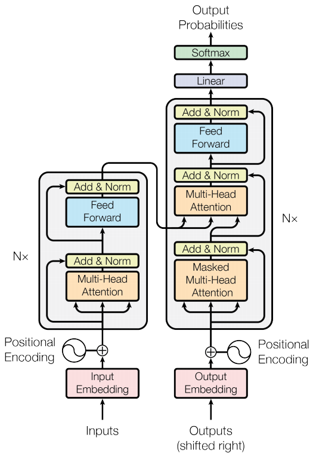

# 模型架构总览
## 1. Transformer
> 原论文链接：https://arxiv.org/abs/1706.03762.pdf

Transformer由多层的 **多头自注意力（Multi-head Self-attention）** 模块堆叠而成的神经网络模型，原始模型由**编码器**和**解码器**组成。
<figure class="half">
    
    

### 1.1 位置编码
- **绝对位置编码** 
    - 正余弦位置编码
    $$
    p_{t,i}=
    \begin{cases}
    \sin{(t/10000^{(i-2)/H})} & i\mathrm{mod}2=0, \\
    \\
    \cos{(t/10000^{(i-1)/H})} & i\mathrm{mod}2=1. & 
    \end{cases}
    $$
- **相对位置编码** 
- **旋转位置编码（RoPE）** 
- **ALiBi位置编码**

### 1.2 归一化
#### 1.2.1 归一化方法
- **LN（LayerNorm）** 
    $$
    \begin{aligned}
    \mathrm{LayerNorm}(x) & =\frac{x-\mu}{\sigma}\cdot\gamma+\beta, \\
    \mu & =\frac{1}{H}\sum_{i=1}^{H}x_{i},\quad\sigma=\sqrt{\frac{1}{H}\sum_{i=1}^{H}(x_{i}-\mu))^{2}}.
    \end{aligned}
    $$
- **BN（BatchNorm）** 
- **RMSNorm** 提高层归一化的训练速度
    $$
    \mathrm{RMSNorm}(x)=\frac{x}{\mathrm{RMS}(x)}\cdot\gamma,\mathrm{RMS}(x)=\sqrt{\frac{1}{H}\sum_{i=1}^{H}x_{i}^{2}}.
    $$
    代码见[RMSNorm.ipynb](./codes/RMSNorm.ipynb)